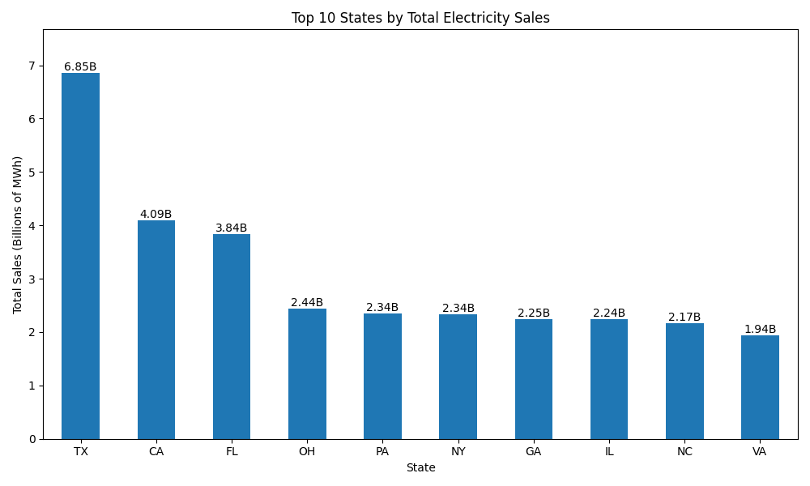
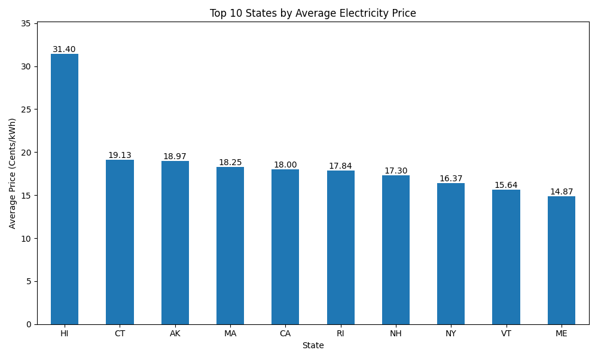
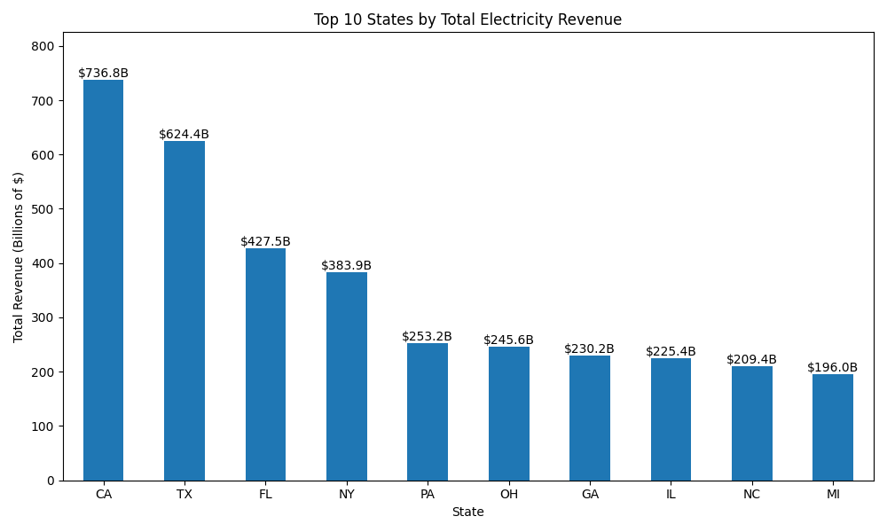
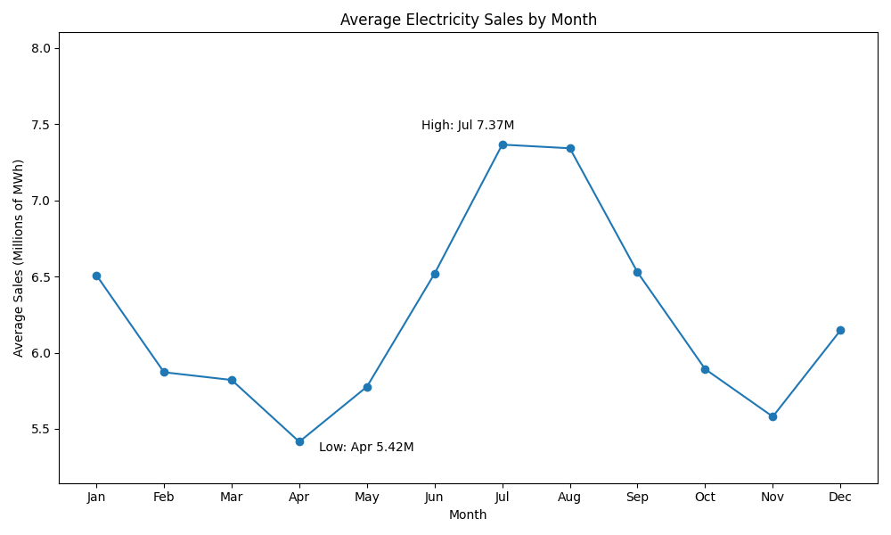
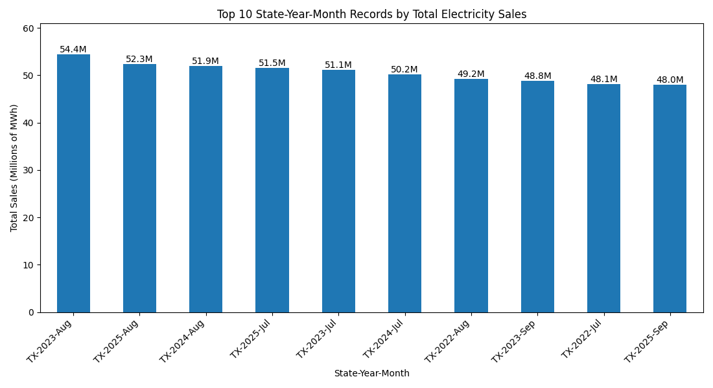
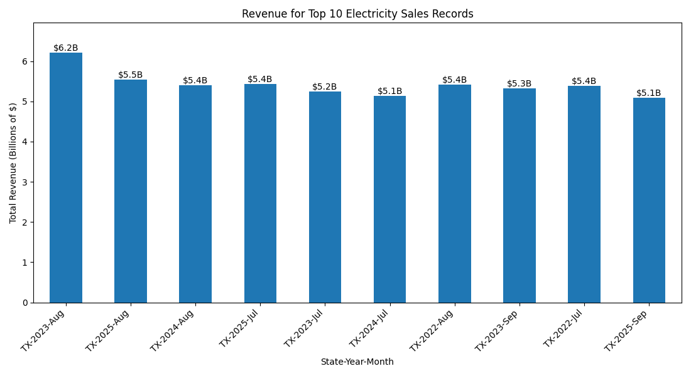
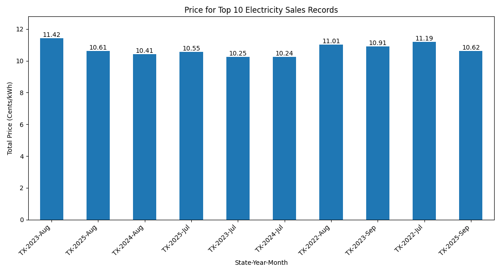

# Smart Utilities Analytics Report

## Overview

This project analyzes monthly electricity sales, revenue, customer count, and retail price data from the U.S. Energy Information Administration.

The project uses Python and Pandas for data cleaning and analysis, Matplotlib for chart generation, and SQLite/SQL for database storage and query-based analysis.

The goal of the project is to turn a raw electricity dataset into a clean, understandable analytics workflow that includes cleaned data, summary tables, charts, SQL validation, and written findings.

## Dataset

Dataset source: EIA electricity sales and revenue monthly state dataset.

Cleaned dataset file:

`data/cleaned/eia_sales_revenue_monthly_states_cleaned.csv`

Number of records:

9,894

Number of columns:

24

Unit of analysis:

Each row represents one state-year-month electricity record.

Main columns used in the analysis:

- `state`
- `year`
- `month`
- `total_revenue_thousand_dollars`
- `total_sales_megawatthours`
- `total_price_cents_kwh`

The dataset also includes residential, commercial, industrial, transportation, and total sector columns for revenue, sales, customer counts, and electricity prices.

## Data Cleaning

The raw EIA data required cleaning before analysis because the original CSV had a multi-row header structure and numeric values stored as strings.

Cleaning steps performed:

- Converted the original Excel dataset into CSV format.
- Identified and handled the multi-row header structure.
- Rebuilt meaningful column names using sector and measurement labels.
- Removed non-data rows, including extra header rows and the footer note row.
- Standardized column names.
- Removed commas from numeric values.
- Converted revenue, sales, customer count, and price columns into numeric data types.
- Converted `year` and `month` into numeric columns.
- Checked for missing values after cleaning.
- Checked for duplicate rows.
- Saved the cleaned dataset to `data/cleaned/`.

The cleaned dataset contains 9,894 rows and 24 columns.

## Analysis Workflow

The project follows a full data analysis workflow:

Raw EIA file  
→ cleaned CSV  
→ Pandas summaries  
→ Matplotlib charts  
→ SQLite database  
→ SQL analysis  
→ final report  

Pandas was used first to explore and summarize the cleaned dataset. The Pandas analysis produced summary tables for electricity sales, revenue, average price, monthly trends, and top individual state-year-month records.

Matplotlib was used to turn the main Pandas findings into charts saved in the `charts/` folder.

SQLite was then used to store the cleaned data in a database table named `electricity_sales`. SQL queries were written to reproduce the main Pandas summaries and confirm that the database analysis matched the Pandas results.

This workflow connects Python, Pandas, Matplotlib, SQLite, and SQL into one reproducible analytics project.

## Key Findings

The analysis produced five main findings:

1. Texas had the highest total electricity sales across the dataset.
2. Hawaii had the highest average electricity price.
3. California had the highest total electricity revenue.
4. Average electricity sales were highest during July and August.
5. The top individual state-year-month electricity sales records were Texas summer records.

These findings show that electricity sales, revenue, and price do not rank states the same way. Texas led in total electricity sales, California led in total revenue, and Hawaii led in average electricity price.

This suggests that high electricity consumption does not automatically mean the highest electricity prices or the highest total revenue. Different states stand out depending on whether the analysis focuses on total usage, cost, or pricing.

The monthly analysis also shows a clear seasonal pattern. Average electricity sales were highest during the summer months, especially July and August, and lowest in April. This suggests that electricity demand rises during warmer months.

The row-level analysis showed that the top individual electricity sales records were all from Texas, mostly during July, August, and September. This supports the finding that Texas had especially high electricity demand during summer months.

## Charts Generated

The project generated seven Matplotlib charts, saved in the `charts/` folder.

### State-Level Charts

These charts compare electricity sales, average electricity price, and total electricity revenue across states. They show that different states lead depending on the measurement being analyzed. Texas led in total electricity sales, California led in total revenue, and Hawaii led in average electricity price.

#### Top 10 States by Total Electricity Sales

#### Top 10 States by Average Electricity Price

#### Top 10 States by Total Electricity Revenue

### Monthly Trend Chart

This chart shows the seasonal pattern in average electricity sales by month. Average electricity sales were highest during July and August and lowest around April.

#### Average Electricity Sales by Month

### Record-Level Charts

These charts focus on the top 10 individual state-year-month records ranked by total electricity sales. They show the sales, revenue, and price values for the highest electricity sales records. The top records were all Texas summer records, mostly from July, August, and September.

#### Top 10 Records by Total Electricity Sales

#### Revenue for Top 10 Electricity Sales Records

#### Price for Top 10 Electricity Sales Records

## SQL Validation

The SQL analysis reproduced the five main Pandas summaries using queries on the SQLite database.

The SQL analysis included:

- Top 10 states by total electricity sales
- Top 10 states by average electricity price
- Top 10 states by total electricity revenue
- Average electricity sales by month
- Top 10 state-year-month records ranked by total sales

This helped confirm that the same findings appeared through both Pandas DataFrame operations and SQL queries on the SQLite database.

The SQL results matched the Pandas results:

- Texas had the highest total electricity sales.
- Hawaii had the highest average electricity price.
- California had the highest total electricity revenue.
- Average electricity sales were highest in July and August.
- The top individual state-year-month electricity sales records were Texas summer records.

This validation step shows that the project results were consistent across both Pandas-based analysis and SQL-based analysis.

## Conclusion

The analysis shows that electricity sales, revenue, and price vary significantly by state and month.

Texas had the highest total electricity sales across the dataset, California had the highest total electricity revenue, and Hawaii had the highest average electricity price. These results show that the state with the highest electricity usage is not necessarily the same state with the highest revenue or highest average price.

The monthly analysis showed a seasonal pattern in electricity sales. Average electricity sales were highest during July and August and lowest in April, suggesting that electricity demand increases during the summer months.

The row-level analysis also showed that the highest individual state-year-month electricity sales records were all Texas summer records. This supports the overall finding that Texas had especially high electricity demand during peak summer months.

Overall, this project demonstrates how Python, Pandas, Matplotlib, SQLite, and SQL can be combined to clean, analyze, visualize, store, and validate real-world electricity data.

## Future Improvements

Future improvements for this project could include:

- Add more SQL queries comparing residential, commercial, industrial, and transportation sector trends.
- Create additional charts showing sector-level electricity sales, revenue, customer counts, and price patterns.
- Build an interactive dashboard to let users filter results by state, year, month, or sector.
- Add automated tests for the data cleaning, database setup, and database loading scripts.
- Improve the README with chart screenshots or preview images.
- Compare electricity trends across multiple years in more detail.
- Add command-line options so users can run specific parts of the workflow more easily.
- Expand the report generation script so it calculates more values dynamically instead of relying mostly on known findings.

These improvements would make the project more interactive, more reusable, and more useful as a portfolio-level data analytics project.
